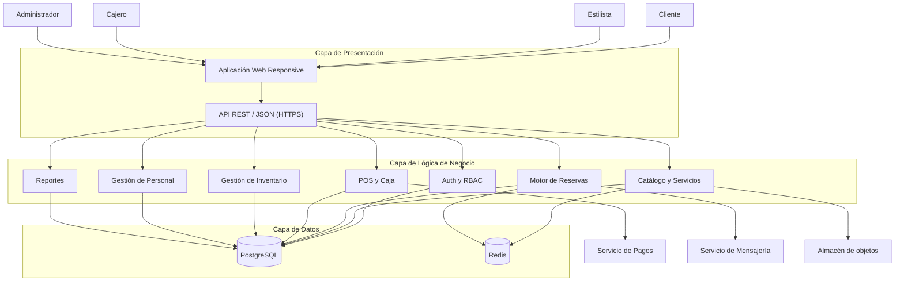

# Arquitectura inicial de AnyColor Salón

## Arquitectura en tres capas

## Descripción

### Capa de presentación

Contiene la aplicación web responsive utilizada por clientes, estilistas, cajeros y administradores.

### Capa de lógica de negocio

Contiene las reglas principales del sistema: autenticación, reservas, ventas, inventario, personal y reportes.

### Capa de datos

PostgreSQL almacena la información transaccional. Redis permite implementar caché y bloqueos temporales para controlar la concurrencia de las reservas.

### Sistemas externos

El sistema puede integrarse con servicios externos de pago y mensajería.
