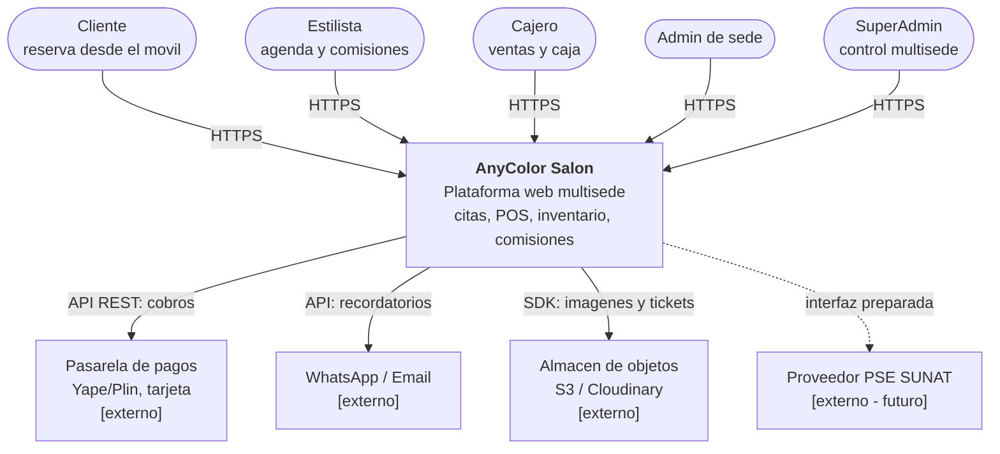
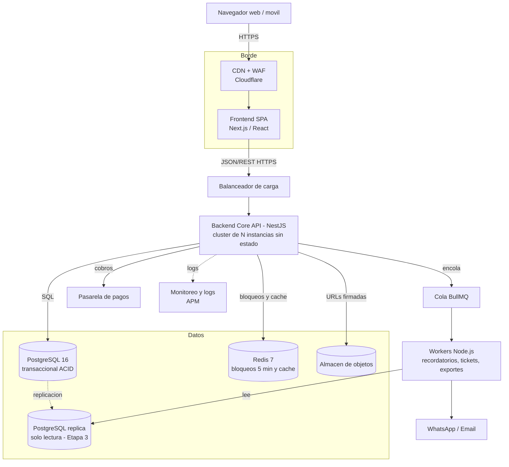
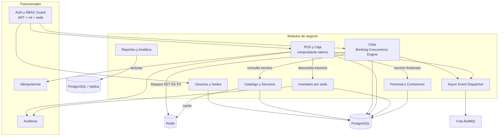
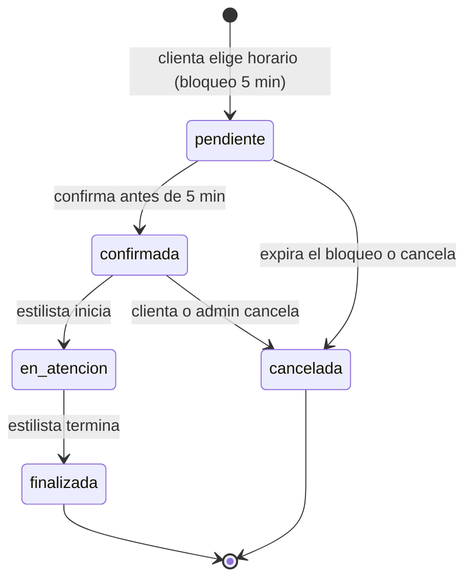
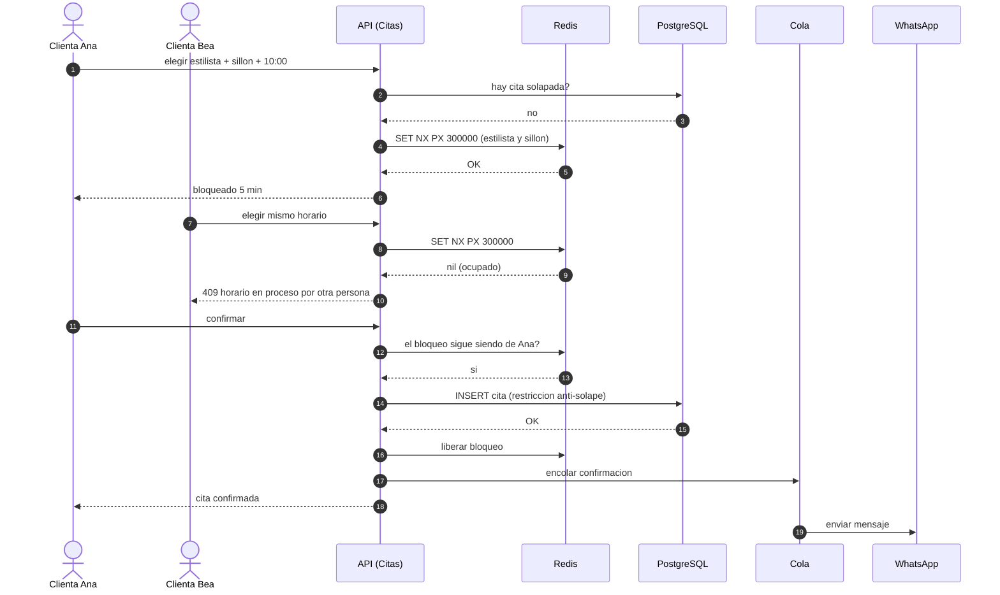
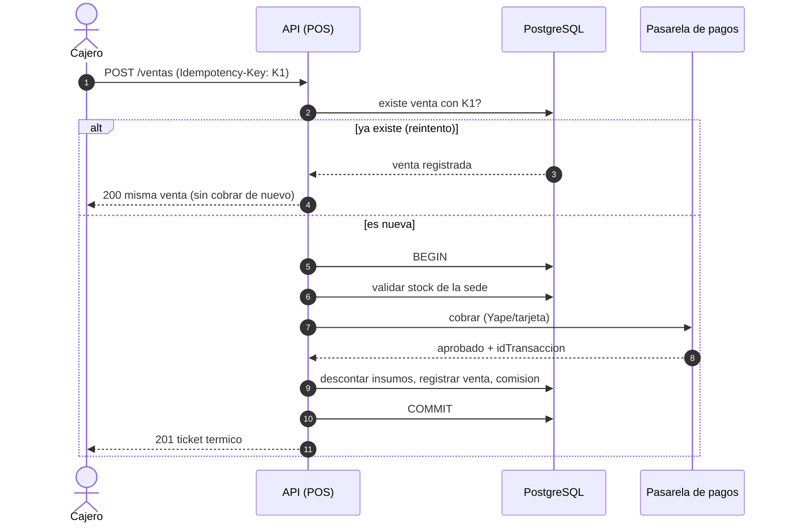
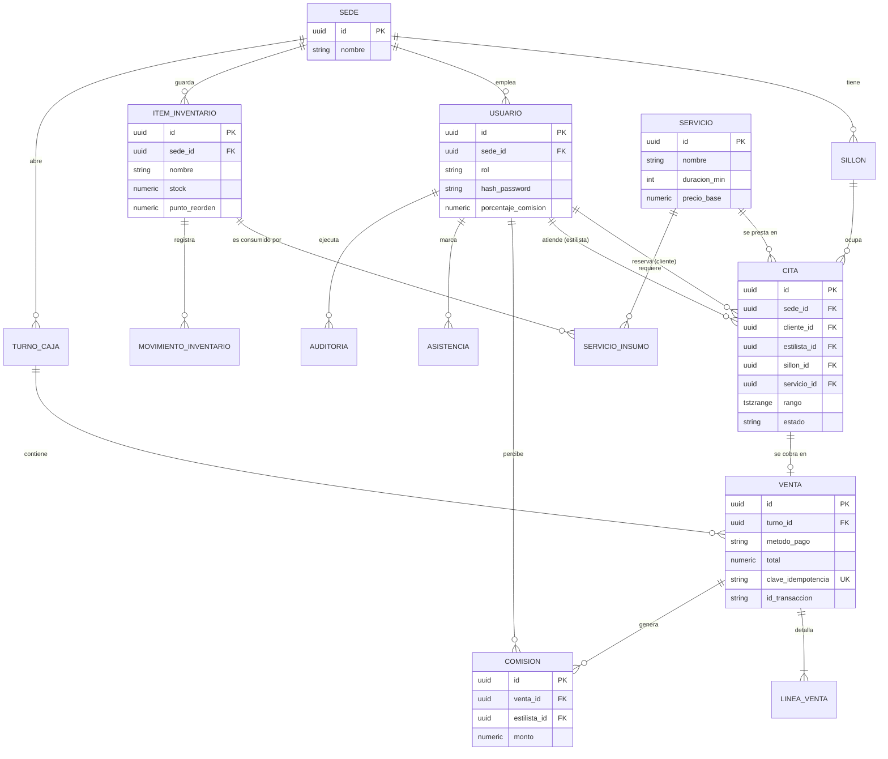
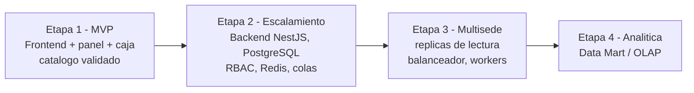

# Diagramas de AnyColor Salón

Todos los diagramas están escritos en Mermaid (GitHub los dibuja automáticamente).

## 1. C4 · Nivel 1 – Contexto

## 2. C4 · Nivel 2 – Contenedores

## 3. C4 · Nivel 3 – Componentes del Backend

## 4. Estados de una cita

## 5. Secuencia · Reserva concurrente

## 6. Secuencia · Venta en el POS (idempotente)

## 7. Modelo de datos (núcleo)

## 8. Roadmap de evolución

