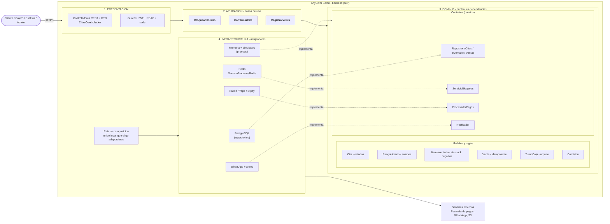

# Enfoque arquitectónico: Clean Architecture

| Elemento | Descripción aplicada a AnyColor Salón |
| --- | --- |
| Patrón / enfoque | Clean Architecture (Arquitectura Limpia). |
| Objetivo | Separar las reglas del salón (citas, caja, inventario, comisiones) de los detalles tecnológicos y apuntar todas las dependencias hacia el dominio. |
| ¿Qué problema resuelve? | Evita acoplar las reglas de reserva y venta a Redis, PostgreSQL, la pasarela de pagos o WhatsApp. Se puede cambiar un proveedor sin reescribir el negocio. |
| Capas | Presentación, Aplicación, Dominio e Infraestructura. |
| Beneficios | Pruebas del negocio sin base de datos ni Redis; reemplazo de adaptadores; código organizado por responsabilidad. |

## Regla de dependencia

> Las flechas de importación apuntan **hacia adentro**: Presentación → Aplicación → Dominio ← Infraestructura.
> El dominio no importa nada. Infraestructura **implementa** los contratos que el dominio declara.

## Mapa de capas en el código (`anycolor-core/src/`)

| Capa | Carpeta | Contenido real |
| --- | --- | --- |
| Dominio | `dominio/modelos` | `Cita` (estados), `RangoHorario`, `ItemInventario`, `Venta`, `TurnoCaja`, `calcularComision`, `bloqueo.modelo` (5 min) |
| Dominio | `dominio/contratos` | `RepositorioCitas`, `RepositorioInventario`, `RepositorioVentas`, `ServicioBloqueos`, `ProcesadorPagos`, `Notificador`, `Reloj` |
| Aplicación | `aplicacion` | `BloquearHorarioCasoUso`, `ConfirmarCitaCasoUso`, `RegistrarVentaCasoUso` |
| Infraestructura | `infraestructura` | Memoria (pruebas), `ServicioBloqueosRedis`, pagos simulado |
| Presentación | `presentacion` | `CitasControlador` (DTO ↔ caso de uso) |

## Diagrama

## Ejemplo: qué cambia si cambia la tecnología

| Cambio | Capas afectadas |
| --- | --- |
| Pasar de Niubiz a Izipay | Solo un adaptador en Infraestructura |
| Cambiar Redis por otro mecanismo de bloqueo | Solo `ServicioBloqueosRedis` |
| Añadir un método de pago "Plin" | Dominio (enum) y un adaptador; los casos de uso casi no cambian |
| Cambiar la regla "bloqueo de 5 min" a 10 | Solo `bloqueo.modelo.ts` |

## Cómo se verifica

`npm run pruebas` (en `anycolor-core/`) ejecuta 16 pruebas del dominio y los casos de uso **sin Next.js, sin PostgreSQL y sin Redis**: la prueba de que el núcleo no depende de la tecnología.
