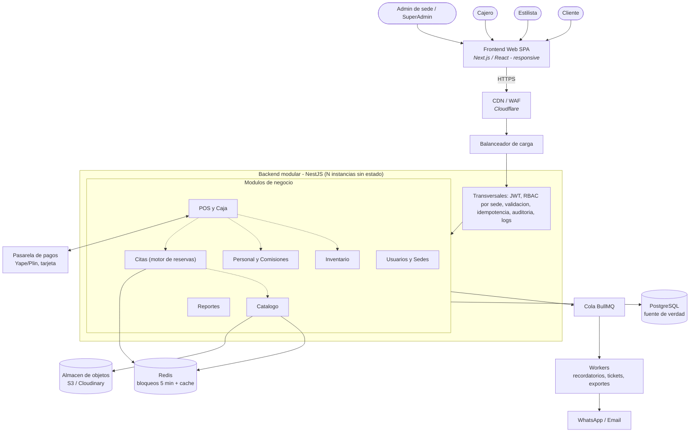

# Estilo arquitectónico seleccionado

**Estilo:** Monolito modular (backend) con organización interna en capas, más un frontend SPA desacoplado por API REST.

## Justificación

| Criterio | Cómo lo satisface el estilo |
| --- | --- |
| Escalabilidad (DA02) | La API es **sin estado**: se replican instancias detrás de un balanceador. |
| Consistencia (DA01, DA03) | Venta, inventario, caja y comisión se resuelven en **una transacción local** de PostgreSQL. |
| Mantenibilidad (DA06) | Módulos con fronteras claras; cada módulo con Clean Architecture (ver `enfoque/`). |
| Costo y operación | Una sola unidad de despliegue para el MVP. |
| Evolución | Los módulos más calientes (Citas, Reportes) pueden extraerse después. |

## Diagrama del estilo (vista de contenedores y módulos)

## Límites del estilo

* El frontend **nunca** habla directo con Redis ni con PostgreSQL: solo consume la API REST.
* Un módulo no lee las tablas de otro: se comunica por su caso de uso o por un evento.
